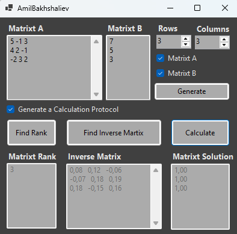
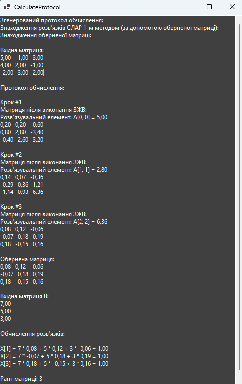

# АЛГОРИТМИ СИСТЕМ ПІДТРИМКИ ПРИЙНЯТТЯ РІШЕНЬ
## ПРАКТИЧНА РОБОТА 1.1 ЗАСТОСУВАННЯ ЗВИЧАЙНИХ ЖОРДАНОВИХ ВИКЛЮЧЕНЬ: ПОШУК ОБЕРНЕНОЇ МАТРИЦІ, ОБЧИСЛЕННЯ РАНГУ МАТРИЦІ, РОЗВ’ЯЗАННЯ СИСТЕМИ ЛІНІЙНИХ АЛГЕБРАЇЧНИХ РІВНЯНЬ.

### Мета роботи
навчитися застосовувати звичайні жорданові виключення (ЗЖВ).

### Опис роботи
Ця програма реалізує метод звичайних Жорданових виключень (ЗЖВ) для виконання наступних операцій з матрицями:
- Пошук оберненої матриці для довільної квадратної матриці.
- Обчислення рангу довільної прямокутної матриці.
- Розв’язання системи лінійних алгебраїчних рівнянь за допомогою оберненої матриці (1-й спосіб).

### Вид програми

Рисунок 1 – Виконання програми

Рисунок 2 – Згенерований протокол обчислень

### Основні методи програми
1. **GaussJordanElimination:** Виконує один крок методу Жорданових виключень.  
2. **ScanMatrix:** Зчитування введених користувачем матриць A та B.  
3. **GenerateMatrix:** Генерація випадкових матриць A та B.  
4. **FindInverseMatrix:** Обчислення оберненої матриці методом Жорданових виключень.  
5. **FindRankMatrix:** Обчислення рангу матриці A.  
6. **FindSolutionMatrixt:** Обчислення розв’язків системи рівнянь за допомогою оберненої матриці.  
7. **FillIn:** Виведення протоколу обчислень.

### Висновки
Програма успішно реалізує метод Жорданових виключень для:
- Знаходження обернених матриць.
- Обчислення рангу матриць.
- Розв’язання систем лінійних алгебраїчних рівнянь.

